<div id="top"></div>
<!--
*** Thanks for checking out the Best-README-Template. If you have a suggestion
*** that would make this better, please fork the repo and create a pull request
*** or simply open an issue with the tag "enhancement".
*** Don't forget to give the project a star!
*** Thanks again! Now go create something AMAZING! :D
-->


<!-- PROJECT SHIELDS -->
<!--
*** I'm using markdown "reference style" links for readability.
*** Reference links are enclosed in brackets [ ] instead of parentheses ( ).
*** See the bottom of this document for the declaration of the reference variables
*** for contributors-url, forks-url, etc. This is an optional, concise syntax you may use.
*** https://www.markdownguide.org/basic-syntax/#reference-style-links
-->

<!-- PROJECT LOGO -->
<br />
<div align="center">
  <a href="https://github.com/othneildrew/Best-README-Template">
    
  </a>

  <h3 align="center">CineFlix</h3>

  <p align="center">
    Projeto final da Lead Academy promovido pela Lead Dell
  </p>
</div>


<!-- ABOUT THE PROJECT -->
## Sobre O Projeto

<div align="center">
   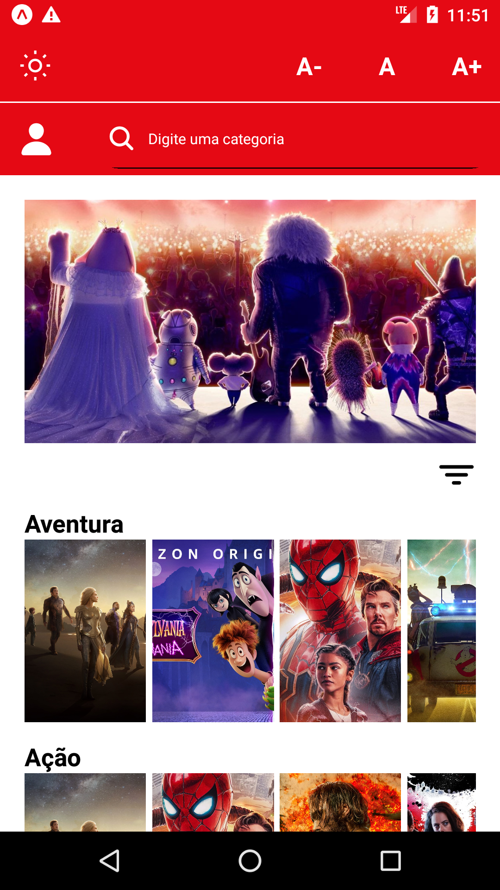
   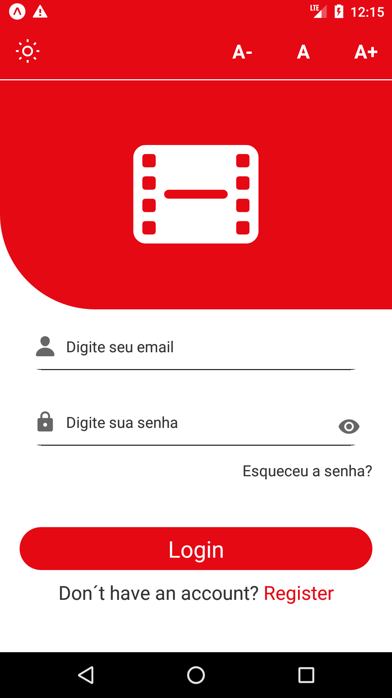
   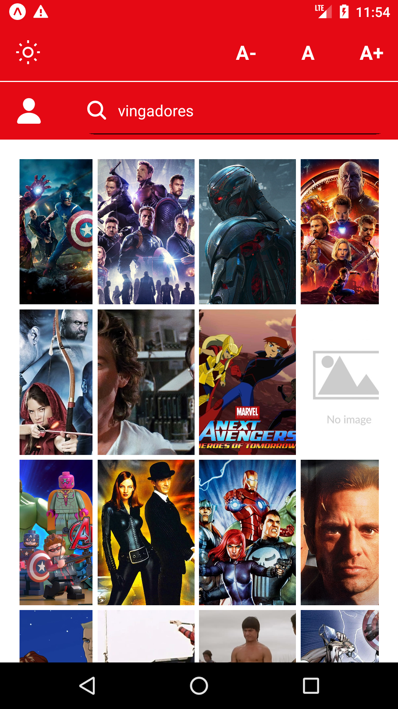
</div>


Esses projeto é o resultado de 3 messes de estudos, dedicação e muitos warnings. Ele utilizada a [The Movie DataBase API](https://www.themoviedb.org/) para obtenção de dados.

Feito com Amor S2

<p align="right">(<a href="#top">back to top</a>)</p>


### Construido Com

Aqui estão algumas das ferramentas que utilizei na construção do aplicativo:

* [React Native](https://nextjs.org/)
* [Styled Cmponents](https://styled-components.com/)
* [Yup](https://github.com/jquense/yup)
* [Formick](https://formik.org/docs/tutorial)
* [Typescript](https://www.typescriptlang.org/)
* [Redux](https://redux.js.org/)
* [Redux Sagas](https://redux-saga.js.org/)
* [Git](https://git-scm.com/)

<p align="right">(<a href="#top">back to top</a>)</p>


### Instalação

2. Clone the repo
   ```sh
   git clone https://github.com/isaniovitor/CineFlix.git
   ```
3. Instale os packages
   ```sh
   yarn
   ```
4. Inicie o Projeto 
   ```js
   expo start
   ```

<p align="right">(<a href="#top">back to top</a>)</p>


<!-- USAGE EXAMPLES -->
## Altenticação

Use os seguintes campos para fazer o login:
1. Email
   ```sh
   admin
   ```
2. Senha
   ```sh
   admin1234
   ```

<p align="right">(<a href="#top">back to top</a>)</p>


<!-- ROADMAP -->
## Funcionalidades

- [x] Dark Mode

  <div align="center">
     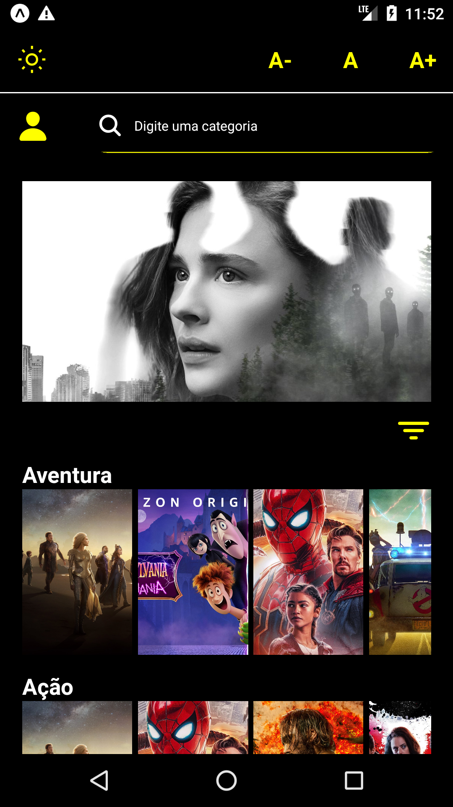
     
  </div>
 
- [x] change font

  <div align="center">
       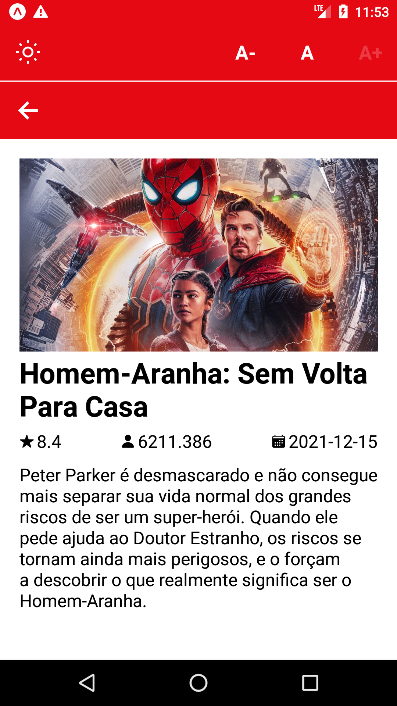
       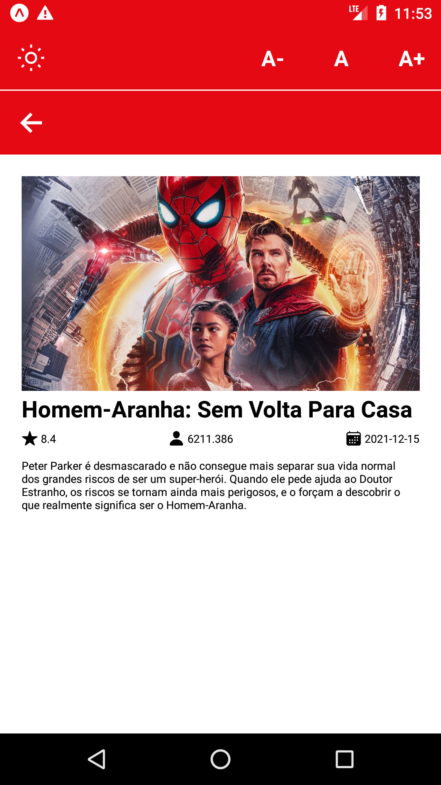
  </div>

- [ ] Telas

   <div align="center">
       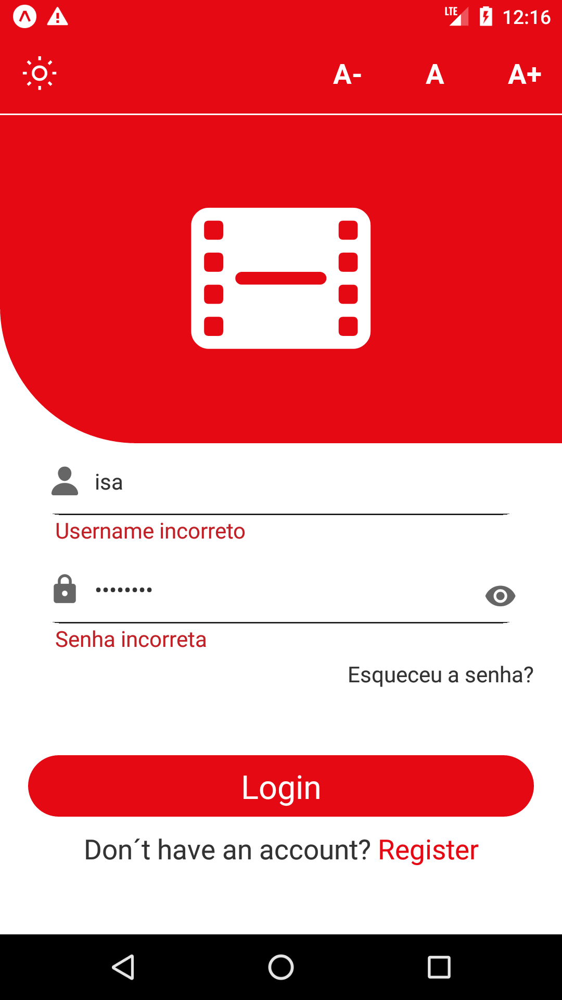
       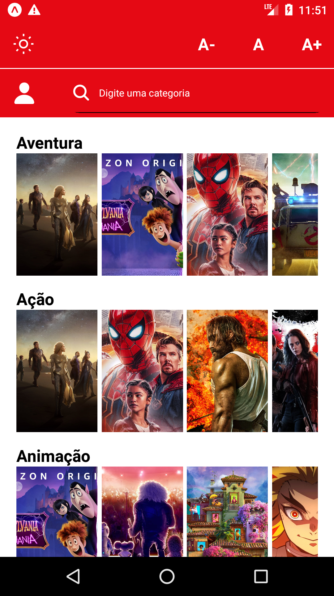
       
       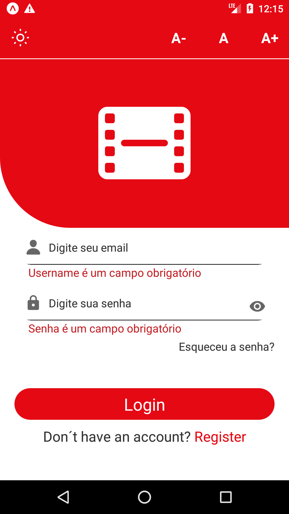
       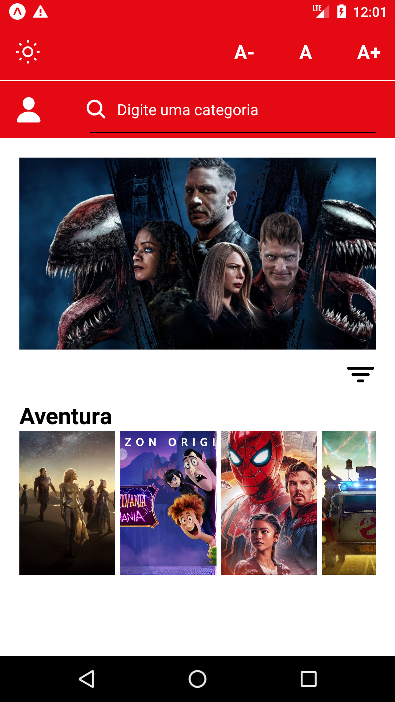
       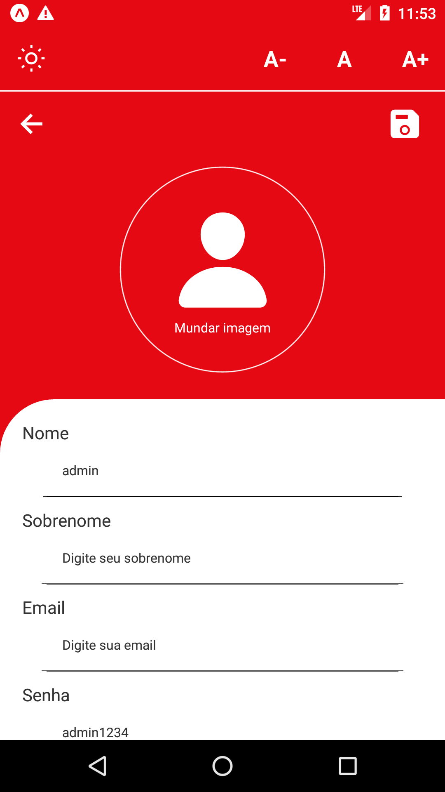
       
       
   </div>

<p align="right">(<a href="#top">back to top</a>)</p>


<!-- CONTRIBUTING -->
## Contribuições

Quaisquer contribuições que você fizer são **muito apreciadas**. Se você tiver uma sugestão para melhorar isso, faça um fork do repositório e crie uma solicitação pull. Você também pode simplesmente abrir um problema com a tag "melhoria".

1. Fork o Projeto
2. Crie sua Feature Branch (`git checkout -b feature/AmazingFeature`)
3. Commit suas mudanças (`git commit -m 'Add some AmazingFeature'`)
4. Push para a Branch (`git push origin feature/AmazingFeature`)
5. Abra um Pull Request

<p align="right">(<a href="#top">back to top</a>)</p>


<!-- CONTACT -->
## Contact

Linkedin - [Isânio Vitor](https://www.linkedin.com/in/is%C3%A2nio-vitor-0b5872209/)

Email: [isaniovitor@alu.ufc.br](isaniovitor@alu.ufc.br)

<p align="right">(<a href="#top">back to top</a>)</p>


<!-- ACKNOWLEDGMENTS -->
## Agradecimentos

Queria agradecer a Lead pelo acolhimento e por me proporcionar esses 3 meses de puro aprendizado e crescimento. Agradeço também aos meus mentores Ruan Lima e Pádua Alves que me ajudaram nessa caminhada e ao meu colega de mentoria Thiago lins por toda a ajuda.

* [Lead Dell](https://leadfortaleza.com.br/portal)
* [Ruan Lima](https://www.linkedin.com/in/ruanblima1/)
* [Pádua Alves](https://www.linkedin.com/in/antonio-de-p%C3%A1dua-alves-feij%C3%A3o-43054b192/)
* [Thiago Lins](https://www.linkedin.com/in/thiago-lins-3b5269211/)

<p align="right">(<a href="#top">back to top</a>)</p>


<!-- MARKDOWN LINKS & IMAGES -->
<!-- https://www.markdownguide.org/basic-syntax/#reference-style-links -->
[contributors-shield]: https://img.shields.io/github/contributors/othneildrew/Best-README-Template.svg?style=for-the-badge
[contributors-url]: https://github.com/othneildrew/Best-README-Template/graphs/contributors
[forks-shield]: https://img.shields.io/github/forks/othneildrew/Best-README-Template.svg?style=for-the-badge
[forks-url]: https://github.com/othneildrew/Best-README-Template/network/members
[stars-shield]: https://img.shields.io/github/stars/othneildrew/Best-README-Template.svg?style=for-the-badge
[stars-url]: https://github.com/othneildrew/Best-README-Template/stargazers
[issues-shield]: https://img.shields.io/github/issues/othneildrew/Best-README-Template.svg?style=for-the-badge
[issues-url]: https://github.com/othneildrew/Best-README-Template/issues
[license-shield]: https://img.shields.io/github/license/othneildrew/Best-README-Template.svg?style=for-the-badge
[license-url]: https://github.com/othneildrew/Best-README-Template/blob/master/LICENSE.txt
[linkedin-shield]: https://img.shields.io/badge/-LinkedIn-black.svg?style=for-the-badge&logo=linkedin&colorB=555
[linkedin-url]: https://linkedin.com/in/othneildrew
[product-screenshot]: src/assets/no_image.jpg
